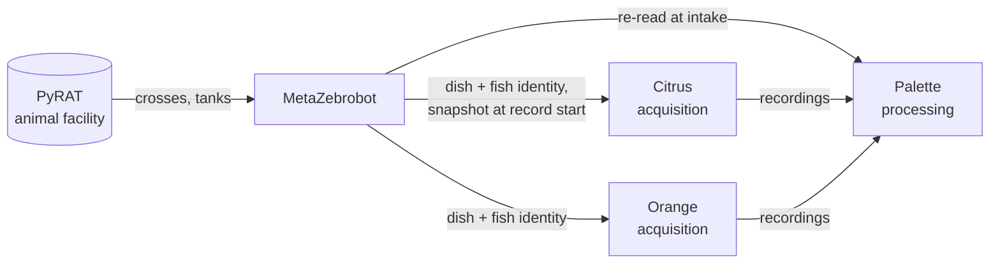

# MetaZebrobot

Colony and experiment metadata for zebrafish research: dishes, screening,
daily care, individual fish, and the PyRAT crosses they came from, served to
the acquisition and analysis tools that record and process experiments.

## Overview

MetaZebrobot is meant to start tracking metadata for my work at Janelia in the Johnson and Ahrens labs. There's a lot more information we can use to better understand our fish behavior and neural data if we just simply look at them I think. So this is a project to integrate literally as much metadata about my projects as I can so every experiment is completely documented from the fish being born down to the fish being studied in a particular place, time, condition, etc...

## What it does today

MetaZebrobot is a FastAPI web app (the main interface) plus an older PySide6
desktop app, both backed by one SQLite database.

**Web workflows** (page-by-page map: [`docs/web_pages.md`](docs/web_pages.md))

- **Dishes**: create dishes from a PyRAT crossing (genotype, parents, dates and
  background filled in automatically), edit counts, transfer fish between
  dishes, terminate, and print QR-code labels that scanners can use to jump
  straight to a dish.
- **Screening**: log screening steps (indicators, pigment, counts, allocation
  outcomes), split fish into derived dishes, and compare against parsed
  transgene tags, mapzebrain atlas matches, and curated genotype reference
  images (including composites generated from OME-TIFFs).
- **Daily care**: feeding, water changes, mortality, and optional care images,
  per dish or per well for well plates. Recorded deaths feed the current fish
  count automatically.
- **Individual fish**: register fish, assign them to wells or other housing
  units, keep their occupancy history, and attach images.
- **Lineage and provenance**: every transfer and split is recorded, so a dish's
  full history back to its cross can be shown as a graph.
- **PyRAT browsers**: open tanks with age warnings, and crossings with raised
  counts and performance pulled from PyRAT.
- **Guided tour**: a walkthrough that creates and then removes sample data.

**Desktop app** (`metazebrobot` entry point): tabs for agarose, fish water,
poly-L-serine, fish dishes, and PyRAT tanks/crossings. Most new work happens in
the web app.

## How it fits with other systems

MetaZebrobot is the source of truth for dish and fish records. Other systems
read from it rather than keeping their own copies:



How dish and fish identity, record revisions, and the endpoints these systems
use are defined: [`docs/zebrobot_snapshot.md`](docs/zebrobot_snapshot.md) and
[`docs/identity_and_provenance_contract.md`](docs/identity_and_provenance_contract.md).

## Running it

The environment is managed with [Pixi](https://pixi.sh); run everything through
`pixi run`.

### Configuration

Create a local `config.json` (see `config.example.json`) pointing at your SQLite
database. It's user-specific and not committed. Uploaded images are stored on
disk beside the database (`screening_images/`, `care_images/`, `fish_images/`,
`dish_images/`), with filenames recorded in SQLite.

### Web/API server

```bash
pixi run python -m metazebrobot.api_server --db-path /path/to/zebrobot.db --port 8000
```

Then open `http://127.0.0.1:8000/`. The server binds to localhost; add
`--lab-network` only if you intentionally want other machines on the LAN to
connect. The schema is created and migrated automatically on startup, so back
up the database before running a new version against it.

For a persistent install, `deploy/metazebrobot-api.service` is an example
systemd unit (see [`API_SERVICE_GUIDE.md`](API_SERVICE_GUIDE.md), which also
covers PyRAT credentials for systemd and an optional nginx front end).

### Desktop app

```bash
pixi run metazebrobot
```

### Tests

```bash
pixi run python -m pytest
```

Pydantic deprecation warnings (Pydantic 1-style models) fail the suite on
purpose (`pyproject.toml`, `[tool.pytest.ini_options]`); use the Pydantic 2
API (`model_config = ConfigDict(...)`, `@field_validator`, `.model_dump()`).

`tests/test_consumer_contract.py` is the API drift check. After an intentional,
additive API change, regenerate the pinned schema with
`pixi run python scripts/export_consumer_openapi.py` and commit it.

## Design notes

[`docs/README.md`](docs/README.md) indexes the design notes and reference
docs: what each is for, and whether it has been checked against the current
code. It is generated from each doc's frontmatter by `scripts/docs_index.py`,
which runs the shared generator from agent-contracts (`docs-contract/`) at a
pinned commit; it needs an agent-contracts checkout next to this repo or at
`$AGENT_CONTRACTS_DIR`. Not indexed there: the
[API service guide](API_SERVICE_GUIDE.md), the pinned consumer API schema
[`docs/api/consumer_openapi.json`](docs/api/consumer_openapi.json), and the
database schema [`docs/schema.sql`](docs/schema.sql).

## Project structure

```
metazebrobot/
├── src/metazebrobot/
│   ├── api_server.py         # FastAPI web UI + JSON API
│   ├── consumer_contract.py  # Pinned consumer API schema extraction
│   ├── cli.py                # Desktop app entry point
│   ├── templates/, static/   # Web UI (Jinja2 + HTMX)
│   ├── models/               # Data models
│   ├── controllers/          # Business logic
│   ├── views/                # Desktop UI (PySide6)
│   ├── data/                 # SQLite access layer and migrations
│   ├── utils/                # PyRAT clients, strain parser, labels, ...
│   └── config/               # Packaged JSON + image assets
├── docs/                     # Design notes; docs/api/ holds the pinned API schema
├── deploy/                   # systemd unit, nginx setup, backup scripts
├── scripts/                  # Maintenance and inspection scripts
├── tests/                    # pytest suite
└── config.example.json       # Example user config
```

## PyRAT integration

MetaZebrobot integrates with [PyRAT](https://www.scionics.com/pyrat.html), which Janelia relies on for animal management.

Store PyRAT API tokens (and optional frontend username/password, used for
crossing performance details) in the system keyring:

```bash
pixi run python pyrat_credentials_tool.py --setup-credentials
```

For systemd deployments, credentials can instead come from environment
variables (`PYRAT_BASE_URL`, `PYRAT_CLIENT_TOKEN`, `PYRAT_USER_TOKEN`, and
optionally `PYRAT_FRONTEND_USERNAME` / `PYRAT_FRONTEND_PASSWORD`);
`scripts/inspect_pyrat_keyring.py --env-format` prints stored keyring values in
a format suitable for a protected `EnvironmentFile`.

Standalone tools:

- `pyrat_query_tool.py`: query tanks by responsible person, rack, status,
  strain, or age; age-status reporting and JSON export.
  `pixi run python pyrat_query_tool.py --responsible "delahantyj"`
- `get_all_user_ids.py`: build the username → PyRAT user ID mapping used to
  scope the web UI's PyRAT pages to the current user.

## Shoddy analysis notebook

The analysis notebook is pretty bad, but its a start I guess. Density matters for fish health. We all knew this. The next steps are to integrate some things with freely swimming behavior batteries to monitor the fish health over time and use these metrics to choose fish for behavior in our rigs and under the scopes. I'm guessing, in the end, it won't actually offer much of a useful pre-screening beyond what we currently do (look at the dish and pick one that's swimming). But my interest in knowing what my animals are like before I plop them into a weird situation is strong and my stubbornness about doing things like this may be even stronger.

## Contributors

Whoever feels like it!

## Acknowledgements

The awesome team at Scionics, the Janelia Aquatics team and especially Jared for putting up with my constant questions, and the Johnson and Ahrens labs for letting me be in the lab! <3
